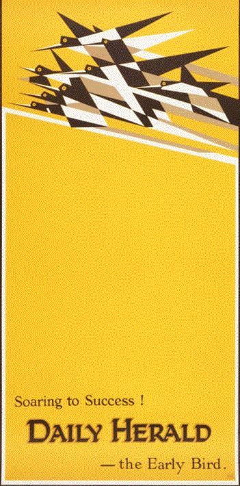

# web-animatie

## Link naar animatie

https://lisanneww.github.io/web-animatie/

## Orginele kunstwerk

Ik heb dit kunstwerk gekozen, omdat ik de geometrische vogels erg interessant vond en direct inspiratie kreeg met wat ik kon doen aan animatie. Het kunstwerk is een poster voor in de Daily Herald newspaper. Deze stijl van illustratie was erg vernieuwend voor begin 1900. De titel is flight met de tekst soaring. Ik wilde inspelen op deze twee termen.

## Intro

Dit vak was een enorme uitdaging voor mij aangezien ik nog niet met code gewerkt hebt. Vandaar dat ik ook veel geleerd heb. Naar mijn ervaring snap ik nu de basis van Html en CSS. Dit heeft mij veel moeite gekost en ik heb hier ook heel veel tijd ingestoken. Niet alles is zoals ik in gedachten had om het te hebben, maar ik ben ver gekomen.

## Functies

1.	Soaring: ik heb door middel van keyframes de vogels laten zweven. Dit heb ik gedaan, omdat soaring een beschrijving is onder het kunstwerk. 
2.	Hover: als je over de vogels heen hovert veranderen de geometrische vlakken van kleur.
3.	Background: ik heb de achtergrond een andere kleur gegeven om de lucht te representeren. Bovendien ik heb wolken toegevoegd, die de andere kant op bewegen, waardoor het lijkt alsof de vogels in beweging zijn. 
4.	Responsive: de vogels worden kleiner naar mate het scherm kleiner wordt. Als het scherm op mobiel formaat is, dan verandert de achtergrond kleur. De lucht gaat van lichtblauw naar donkerblauw om dag en nacht te representeren.
5.	Fly: Als je op de button klikt, dan gaan de vogels vliegen in plaats van zweven. 

## Bronnen

https://jsfiddle.net/Ronindebeek/revh682m/7/

https://codepen.io/lionelB/pen/gckDu

https://www.youtube.com/watch?v=gWai7fYp9PY
